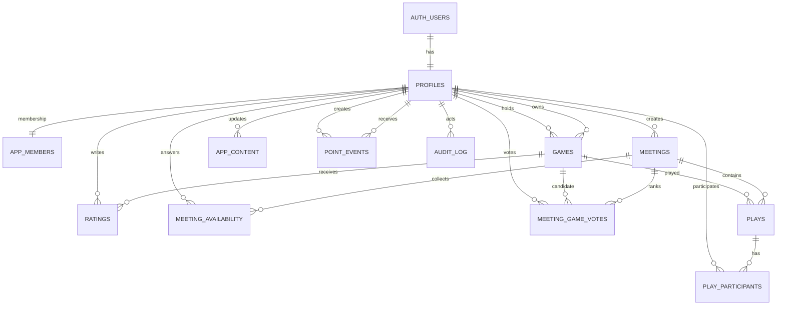

# Projekt MVP 1 — prywatna biblioteka planszówek

Status: Etapy 1–7 są zamknięte. Auth, aktywne członkostwo, profil, wspólna Półka, oceny, dodatki, Kalendarium, Kronika i Stół działają na prawdziwym Supabase; Etap 8 jest w toku.

## 1. Decyzje projektowe

1. Aplikacja obsługuje jedną zamkniętą grupę znajomych. Nie budujemy systemu wielu grup ani publicznych profili.
2. Rekord `game` oznacza fizyczny egzemplarz gry należący do konkretnej osoby. Dwie osoby mogą dodać tę samą grę jako dwa osobne rekordy.
3. Konto można utworzyć wyłącznie przez zaproszenie administratora. W aplikacji nie będzie publicznej rejestracji.
4. Średnia ocena i ranking gier na spotkanie są wyliczane z danych źródłowych, a nie zapisywane ręcznie.
5. Mechaniki i kategorie są przechowywane jako listy tagów (`text[]`). Dla małej, prywatnej biblioteki jest to prostsze niż osobne słowniki i tabele pośrednie, a nadal pozwala skutecznie filtrować dane.
6. „Usunięcie” gry z biblioteki oznacza archiwizację przez ustawienie `archived_at`. Zachowujemy rekord, aby nie zniszczyć ocen i historii partii.
7. Komentarze na karcie gry w MVP 1 pochodzą z ocen użytkowników. Nie powstaje osobny moduł dyskusji.
8. Pierwszy głos na grę podczas spotkania jednocześnie dodaje ją do rankingu propozycji. Osobna tabela propozycji nie jest potrzebna.
9. Daty są przechowywane jako `timestamptz` w UTC i wyświetlane w strefie użytkownika, domyślnie `Europe/Warsaw`.
10. Każdy aktywny użytkownik ma rolę `member` albo `admin`. Member zarządza głównie własnymi rekordami, a admin może korygować dane całej grupy.
11. Zwykły member nigdy nie może zmienić `games.owner_id`. Transfer egzemplarza jest operacją administracyjną i podlega audytowi.
12. Wybrane teksty aplikacji pochodzą z `app_content`, ale nie powstaje pełny CMS ani panel `/admin` w MVP 1.
13. Punkty są projektowane jako niezmienny ledger `point_events`; saldo jest wyliczane przez `SUM(points)`. Automatyczne naliczanie pozostaje poza MVP 1, a ekran Legendarium jest wyłącznie statyczną zapowiedzią MVP 2.
14. Audyt obejmuje ważne zmiany administracyjne, a nie odczyty ani zwykłe interakcje użytkowników.
15. Półka jest wspólną kolekcją fizycznych egzemplarzy całej grupy. Właściciel i aktualny posiadacz pozostają atrybutami każdego rekordu, ale nie tworzymy osobnej sekcji „moja półka”.
16. Główna architektura informacji to: Stół, Półka, Legendarium, Kalendarium i Kronika. Te nazwy są kontraktem UI na kolejne etapy.

## 2. Struktura techniczna projektu

### Stack

- Next.js z App Routerem i TypeScript w trybie `strict`.
- React Server Components do odczytu danych i Server Actions do mutacji formularzy.
- Client Components tylko tam, gdzie potrzebna jest bezpośrednia interakcja: filtry, formularze, RSVP i głosowanie.
- Tailwind CSS oraz mały zestaw lokalnych komponentów UI.
- Supabase: Postgres, Auth i opcjonalnie Storage dla avatarów/okładek w dalszej części MVP.
- Walidacja tych samych reguł po stronie formularzy i serwera.
- RLS w bazie jako ostateczna warstwa autoryzacji; ukrycie strony w interfejsie nie jest traktowane jako zabezpieczenie.

### Proponowane katalogi

```text
src/
  app/
    (auth)/
      logowanie/
      ustaw-haslo/
    auth/callback/
    (app)/
      page.tsx                 # Stół
      gry/                     # Półka
      legendarium/             # statyczna zapowiedź MVP 2
      kalendarium/
      kronika/
      moja-polka/              # przekierowanie do /gry
      spotkania/               # przekierowanie do /kalendarium
      rozgrywki/               # przekierowanie do /kronika
      profil/
      znajomi/[id]/
  components/
    ui/                        # przyciski, pola, dialogi, badge, skeletony
    layout/                    # nawigacja desktop/mobile
  features/
    auth/
    games/
    ratings/
    meetings/
    plays/
    legendarium/
    dashboard/
  lib/
    supabase/
      client.ts
      server.ts
    validation/
    dates/
    utils/
  types/
    database.generated.ts
  proxy.ts                     # odświeżanie sesji i wstępna ochrona tras
supabase/
  migrations/
  seed.sql
scripts/
  import-games-csv.ts          # jednorazowy import, bez panelu w UI
tests/
  unit/
  e2e/
```

Kod związany z konkretną funkcją trafia do `features`, a `app` pozostaje cienką warstwą tras i kompozycji ekranów. Zapytania odczytujące dane będą wykonywane na serwerze. Filtry biblioteki będą zapisane w parametrach URL, dzięki czemu widok da się odświeżyć i udostępnić bez utraty stanu.

## 3. Model danych Supabase

### Typy wyliczeniowe

| Typ               | Wartości                             |
| ----------------- | ------------------------------------ |
| `membership_role` | `member`, `admin`                    |
| `game_status`     | `available`, `unavailable`, `loaned` |
| `meeting_status`  | `planned`, `confirmed`, `completed`  |

`game_type` pozostaje tekstem. Typy gier mogą się zmieniać i nie warto blokować ich sztywnym enumem.

### Użytkownicy i dostęp

#### `profiles`

| Kolumna        | Typ             | Uwagi                                                              |
| -------------- | --------------- | ------------------------------------------------------------------ |
| `id`           | `uuid` PK       | FK do `auth.users.id`                                              |
| `display_name` | `text`          | wymagane                                                           |
| `email`        | `text` unique   | kopia adresu logowania do wyświetlania, tylko do odczytu w profilu |
| `avatar_url`   | `text` nullable | opcjonalny avatar                                                  |
| `created_at`   | `timestamptz`   | automatycznie                                                      |
| `updated_at`   | `timestamptz`   | automatycznie                                                      |

#### `app_members`

| Kolumna     | Typ               | Uwagi                        |
| ----------- | ----------------- | ---------------------------- |
| `user_id`   | `uuid` PK         | FK do `profiles.id`          |
| `role`      | `membership_role` | domyślnie `member`           |
| `is_active` | `boolean`         | warunek wejścia do aplikacji |
| `joined_at` | `timestamptz`     | automatycznie                |

Oddzielenie członkostwa od profilu zapobiega samodzielnemu nadaniu sobie roli lub ponownemu aktywowaniu konta przez użytkownika.

### Treści zarządzane z bazy

#### `app_content`

| Kolumna       | Typ             | Uwagi                                                            |
| ------------- | --------------- | ---------------------------------------------------------------- |
| `content_key` | `text` PK       | stabilny klucz używany przez aplikację                           |
| `value`       | `text`          | treść; nie może być pusta dla aktywnego klucza                   |
| `updated_by`  | `uuid` nullable | FK do `profiles.id`; `null` dla wartości seedowanych technicznie |
| `created_at`  | `timestamptz`   | domyślnie `now()`                                                |
| `updated_at`  | `timestamptz`   | automatycznie przez wspólny trigger                              |

Tabela nie jest pełnym CMS-em. Przechowuje wyłącznie zatwierdzony zestaw krótkich treści, na przykład:

- `dashboard.hero.title`
- `dashboard.hero.description`
- `shelf.heading`
- `shelf.description`
- `legendarium.heading`
- `calendar.heading`
- `chronicle.heading`

Aktywni członkowie mogą odczytywać treści, ale tylko admin może je dodawać i zmieniać. Wartości startowe trafiają do `seed.sql`. Warstwa aplikacji będzie używać centralnego helpera `getAppContent(contentKey, fallback)`, aby brak rekordu nie powodował pustego UI. Zmiana treści przez admina zapisuje `updated_by = auth.uid()` oraz wpis w `audit_log`.

### Gry

#### `games`

| Kolumna             | Typ                     | Uwagi                                             |
| ------------------- | ----------------------- | ------------------------------------------------- |
| `id`                | `uuid` PK               | automatycznie                                     |
| `title`             | `text`                  | wymagane                                          |
| `owner_id`          | `uuid`                  | FK do `profiles`; właściciel egzemplarza          |
| `current_holder_id` | `uuid` nullable         | FK do `profiles`; osoba mająca egzemplarz obecnie |
| `cover_url`         | `text` nullable         | adres okładki                                     |
| `bgg_url`           | `text` nullable         | ręcznie wpisywany link                            |
| `bgg_rank`          | `integer` nullable      | wartość dodatnia                                  |
| `game_type`         | `text` nullable         | typ gry                                           |
| `min_players`       | `smallint` nullable     | minimum graczy                                    |
| `max_players`       | `smallint` nullable     | maksimum graczy; `min <= max`                     |
| `play_time_minutes` | `integer` nullable      | typowy czas w minutach                            |
| `release_year`      | `smallint` nullable     | rok wydania                                       |
| `mechanics`         | `text[]`                | domyślnie pusta lista                             |
| `categories`        | `text[]`                | domyślnie pusta lista                             |
| `bgg_weight`        | `numeric(3,2)` nullable | zakres 1–5                                        |
| `min_age`           | `smallint` nullable     | wartość nieujemna                                 |
| `designer`          | `text` nullable         | autor/projektant                                  |
| `publisher`         | `text` nullable         | wydawca                                           |
| `description`       | `text` nullable         | opis                                              |
| `status`            | `game_status`           | domyślnie `available`                             |
| `created_at`        | `timestamptz`           | automatycznie                                     |
| `updated_at`        | `timestamptz`           | automatycznie                                     |
| `archived_at`       | `timestamptz` nullable  | archiwizacja bez niszczenia historii              |

Reguły interfejsu:

- przy `available` posiadaczem jest zwykle właściciel;
- przy `loaned` `current_holder_id` powinien wskazywać inną osobę;
- `unavailable` opisuje egzemplarz czasowo niedostępny niezależnie od lokalizacji;
- member może edytować i archiwizować wyłącznie własny egzemplarz;
- member może zmieniać `current_holder_id` własnej gry, ale `owner_id` w jego operacji musi pozostać równy `auth.uid()`;
- admin może edytować lub archiwizować dowolny egzemplarz oraz zmieniać `owner_id` i `current_holder_id`; transfer właściciela jest zapisywany w `audit_log`.

#### `game_expansions`

| Kolumna      | Typ           | Uwagi                                                    |
| ------------ | ------------- | -------------------------------------------------------- |
| `id`         | `uuid` PK     | automatycznie                                            |
| `game_id`    | `uuid`        | FK do `games`, kasowanie kaskadowe                       |
| `name`       | `text`        | wymagane, `btrim(name) <> ''`                            |
| `is_owned`   | `boolean`     | `true` = dodatek fizycznie posiadany, `false` = brak go na półce |
| `created_at` | `timestamptz` | automatycznie                                            |
| `updated_at` | `timestamptz` | automatycznie                                            |

Relacje i zasady:

- każdy rekord należy do konkretnego fizycznego egzemplarza z `games`;
- ta sama nazwa dodatku może istnieć przy dwóch różnych kopiach gry;
- w obrębie jednego `game_id` nazwa jest unikalna bez rozróżniania wielkości liter;
- aktywny member może czytać listy dodatków, ale tylko właściciel egzemplarza albo admin może dodawać, usuwać i przełączać `is_owned`;
- karta gry pokazuje pełną listę checkboxów, a szybki podgląd Półki pokazuje wyłącznie dodatki oznaczone jako posiadane.

#### `ratings`

| Kolumna               | Typ             | Uwagi                            |
| --------------------- | --------------- | -------------------------------- |
| `id`                  | `uuid` PK       | automatycznie                    |
| `game_id`             | `uuid`          | FK do `games`                    |
| `user_id`             | `uuid`          | FK do `profiles`                 |
| `overall`             | `smallint`      | 1–10                             |
| `replayability`       | `smallint`      | 1–10                             |
| `theme`               | `smallint`      | 1–10                             |
| `wants_to_play_again` | `boolean`       | tak/nie                          |
| `comment`             | `text` nullable | komentarz widoczny na karcie gry |
| `created_at`          | `timestamptz`   | automatycznie                    |
| `updated_at`          | `timestamptz`   | automatycznie                    |

Unikalność: `(game_id, user_id)`. Jedna osoba ma jedną edytowalną ocenę danej gry.

Widok `game_rating_summaries` wylicza co najmniej `average_overall` i `ratings_count`. Można także pokazać średnie składowe, ale głównym rankingiem jest ocena ogólna.

### Spotkania i RSVP

#### `meetings`

| Kolumna       | Typ              | Uwagi                               |
| ------------- | ---------------- | ----------------------------------- |
| `id`          | `uuid` PK        | automatycznie                       |
| `created_by`  | `uuid`           | FK do `profiles`                    |
| `title`       | `text`           | wymagane                            |
| `description` | `text` nullable  | opis                                |
| `location`    | `text` nullable  | lokalizacja                         |
| `starts_at`   | `timestamptz`    | początek wydarzenia                 |
| `ends_at`     | `timestamptz`    | koniec wydarzenia, zawsze > start   |
| `status`      | `meeting_status` | `planned`, `confirmed`, `completed` |
| `created_at`  | `timestamptz`    | automatycznie                       |
| `updated_at`  | `timestamptz`    | automatycznie                       |

Jedno spotkanie oznacza dokładnie jedno wydarzenie kalendarzowe od `starts_at` do `ends_at`. Model spotkania został uproszczony do jednego zakresu czasu dla całego wydarzenia.

#### `meeting_availability`

| Kolumna      | Typ           | Uwagi                             |
| ------------ | ------------- | --------------------------------- |
| `meeting_id` | `uuid`        | FK do `meetings`                  |
| `user_id`    | `uuid`        | FK do `profiles`                  |
| `is_available` | `boolean`   | jawne RSVP: będzie / nie może     |
| `updated_at` | `timestamptz` | automatycznie                     |

Klucz główny: `(meeting_id, user_id)`. Każdy aktywny członek zapisuje wyłącznie własną odpowiedź `true` lub `false`. Brak rekordu oznacza `Brak odpowiedzi`. To jest prosty model RSVP dla jednego wydarzenia.

#### `meeting_game_votes`

| Kolumna      | Typ           | Uwagi            |
| ------------ | ------------- | ---------------- |
| `meeting_id` | `uuid`        | FK do `meetings` |
| `game_id`    | `uuid`        | FK do `games`    |
| `user_id`    | `uuid`        | FK do `profiles` |
| `created_at` | `timestamptz` | automatycznie    |

Klucz główny: `(meeting_id, game_id, user_id)`. Jeden użytkownik może zagłosować na wiele gier, ale tylko raz na każdą. Pierwszy głos jednocześnie dodaje grę do puli kandydatów spotkania. Widok `meeting_game_rankings` grupuje głosy według spotkania i gry.

### Historia rozgrywek

#### `plays`

| Kolumna            | Typ                | Uwagi                                       |
| ------------------ | ------------------ | ------------------------------------------- |
| `id`               | `uuid` PK          | automatycznie                               |
| `game_id`          | `uuid`             | FK do `games`; usunięcie gry jest blokowane |
| `meeting_id`       | `uuid` nullable    | FK do `meetings`; `null` dla partii spontanicznej |
| `created_by`       | `uuid`             | FK do `profiles`                            |
| `played_at`        | `timestamptz`      | faktyczna data partii                       |
| `duration_minutes` | `integer` nullable | wartość dodatnia                            |
| `comment`          | `text` nullable    | komentarz                                   |
| `created_at`       | `timestamptz`      | automatycznie                               |
| `updated_at`       | `timestamptz`      | automatycznie                               |

Partia może wynikać ze spotkania w Kalendarium albo być spontaniczna. Usunięcie powiązanego spotkania ustawia `meeting_id = null`, zachowując wpis historyczny w Kronice.

#### `play_participants`

| Kolumna     | Typ                      | Uwagi                                  |
| ----------- | ------------------------ | -------------------------------------- |
| `play_id`   | `uuid`                   | FK do `plays`, kasowanie kaskadowe     |
| `user_id`   | `uuid`                   | FK do `profiles`                       |
| `placement` | `smallint` nullable      | miejsce dodatnie; remis jest dozwolony |
| `score`     | `numeric(12,2)` nullable | opcjonalne punkty                      |
| `is_winner` | `boolean`                | zwycięzca                              |

Klucz główny: `(play_id, user_id)`. Interfejs MVP 1 wymusza co najmniej jednego gracza i jednego zwycięzcę. Model toleruje współdzielone zwycięstwo lub grę kooperacyjną bez przebudowy bazy.

### Punkty — fundament MVP 2

#### `point_events`

| Kolumna               | Typ             | Uwagi                                                    |
| --------------------- | --------------- | -------------------------------------------------------- |
| `id`                  | `uuid` PK       | domyślnie `gen_random_uuid()`                            |
| `user_id`             | `uuid`          | FK do `profiles.id`; odbiorca punktów                    |
| `points`              | `integer`       | dodatnia lub ujemna zmiana; `CHECK (points <> 0)`        |
| `action_type`         | `text`          | wymagany stabilny identyfikator zdarzenia                |
| `description`         | `text` nullable | czytelne wyjaśnienie zdarzenia lub korekty               |
| `related_entity_type` | `text` nullable | np. `play`, `meeting`, `game`                            |
| `related_entity_id`   | `uuid` nullable | identyfikator powiązanego rekordu bez polimorficznego FK |
| `created_by`          | `uuid`          | FK do `profiles.id`; autor zdarzenia                     |
| `created_at`          | `timestamptz`   | domyślnie `now()`                                        |

Pola powiązania spełniają regułę „oba puste albo oba ustawione”: `related_entity_type` nie może istnieć bez `related_entity_id` i odwrotnie. Ledger jest append-only: rekordów nie edytujemy i nie usuwamy. Błąd koryguje nowe zdarzenie, a ręczna korekta administratora używa `action_type = 'admin_adjustment'`. W MVP 1 nie istnieją triggery automatycznie przyznające punkty ani UI grywalizacji.

Widok `user_point_balances` wylicza saldo jako `COALESCE(SUM(points), 0)` grupowane po użytkowniku i ma `security_invoker = true`. Member widzi w nim tylko własne saldo, a admin salda wszystkich aktywnych członków. Szczegółowy ledger pozostaje ograniczony do własnych zdarzeń membera i wszystkich zdarzeń admina; w MVP 1 tylko admin może dodać ręczne zdarzenie.

Globalny ranking udostępnia osobny, wąski kontrakt RPC `get_leaderboard()`. Funkcja przed odczytem wymaga aktywnego członkostwa, ma `SECURITY DEFINER` i pusty `search_path`, obejmuje wyłącznie aktywnych członków oraz zwraca tylko `user_id`, `display_name`, `avatar_url`, `total_points` i `rank`. Nie ujawnia opisów, powiązań, autora ani innych szczegółów `point_events` i nie poszerza polityki `SELECT` surowego ledgeru.

### Audyt zmian administracyjnych

#### `audit_log`

| Kolumna         | Typ              | Uwagi                                                |
| --------------- | ---------------- | ---------------------------------------------------- |
| `id`            | `uuid` PK        | domyślnie `gen_random_uuid()`                        |
| `actor_user_id` | `uuid`           | FK do `profiles.id`; administrator wykonujący zmianę |
| `action`        | `text`           | np. `game.owner_changed`, `meeting.updated`          |
| `entity_type`   | `text`           | rodzaj zmienianego zasobu                            |
| `entity_id`     | `uuid` nullable  | identyfikator zasobu, jeśli istnieje                 |
| `old_data`      | `jsonb` nullable | stan przed zmianą                                    |
| `new_data`      | `jsonb` nullable | stan po zmianie                                      |
| `created_at`    | `timestamptz`    | domyślnie `now()`                                    |

`audit_log` jest append-only. Klient nie otrzymuje polityki bezpośredniego `INSERT`, `UPDATE` ani `DELETE`; wpisy tworzy funkcja `private.write_audit_log(...)` wywoływana przez kontrolowane funkcje lub triggery administracyjne. Odczyt ma tylko admin.

Audytujemy przede wszystkim:

- zmianę roli lub aktywności użytkownika;
- administracyjną edycję/archiwizację gry oraz zmianę `owner_id` lub `current_holder_id`;
- administracyjną korektę spotkania;
- administracyjną korektę rozgrywki oraz jej uczestników, zwycięzców, miejsc i punktów;
- zmianę `app_content`;
- dodanie ręcznej korekty `point_events`.

Nie zapisujemy zwykłych odczytów, filtrowania, głosów, odpowiedzi RSVP ani każdej standardowej edycji własnego rekordu przez membera.

### Relacje



### Indeksy

- `games(owner_id)`, `games(current_holder_id)`, `games(created_at desc)`.
- indeks po `lower(title)`; dla większej liczby rekordów można dołożyć `pg_trgm`, ale nie jest wymagany na start.
- indeksy GIN na `games(mechanics)` i `games(categories)`.
- `ratings(game_id)`.
- `meetings(status)` i `meetings(starts_at)`.
- `meeting_availability(user_id)`.
- `meeting_game_votes(meeting_id, game_id)`.
- `plays(played_at desc)`, `plays(game_id)`, `plays(meeting_id)`.
- `play_participants(user_id)`.
- `app_content(updated_at desc)`.
- `point_events(user_id, created_at desc)`, `point_events(action_type)` oraz częściowy indeks `(related_entity_type, related_entity_id)` dla niepustych powiązań.
- `audit_log(created_at desc)`, `audit_log(actor_user_id, created_at desc)` i `audit_log(entity_type, entity_id)`.

## 4. Ekrany i ścieżki

| Ścieżka                    | Ekran                       | Zakres                                                             |
| -------------------------- | --------------------------- | ------------------------------------------------------------------ |
| `/logowanie`               | Wejście do Chaty            | email + hasło, link odzyskania/ustawienia hasła                    |
| `/auth/callback`           | Obsługa linku z zaproszenia | techniczna trasa bez stałego widoku                                |
| `/ustaw-haslo`             | Ustawienie hasła            | używane po zaproszeniu lub odzyskaniu dostępu                      |
| `/`                        | Stół                        | najbliższe spotkanie, RSVP do uzupełnienia, nowe gry, ostatnie partie, top ocen |
| `/gry`                     | Półka                       | wspólna kolekcja grupy, wyszukiwanie i wszystkie wymagane filtry   |
| `/gry/nowa`                | Dodanie gry                 | formularz egzemplarza; właścicielem jest zalogowana osoba          |
| `/gry/[id]`                | Karta gry                   | dane podstawowe, właściciel, BGG, oceny i historia partii          |
| `/gry/[id]/edytuj`         | Edycja gry                  | właściciel lub admin; member bez zmiany właściciela                |
| `/legendarium`             | Legendarium                 | statyczna makieta rankingu, wyzwań, punktów i osiągnięć dla MVP 2  |
| `/kalendarium`             | Kalendarium                 | najbliższe, planowane i zakończone spotkania                       |
| `/kalendarium/nowe`        | Nowe spotkanie              | prosty formularz wydarzenia od–do                                  |
| `/kalendarium/[id]`        | Szczegóły spotkania         | metadata spotkania, RSVP grupy i propozycje gier                   |
| `/kalendarium/[id]/edytuj` | Edycja spotkania            | twórca lub admin                                                   |
| `/kronika`                 | Kronika                     | historia wszystkich partii z uczestnikami i pełnymi wynikami       |
| `/kronika/nowa`            | Zapis partii                | gra, spotkanie, gracze, wynik, czas, komentarz                     |
| `/kronika/[id]`            | Szczegóły partii            | spotkanie, uczestnicy, miejsca, punkty i zwycięzca                 |
| `/profil`                  | Karta Gracza                | nazwa, email, avatar, skrót własnej historii                       |
| `/znajomi/[id]`            | Profil znajomego            | jego gry i historia rozgrywek                                      |

Stare wejścia `/moja-polka`, `/spotkania` i `/rozgrywki` pozostają wyłącznie jako przekierowania odpowiednio do `/gry`, `/kalendarium` i `/kronika`. Nie utrzymujemy pod nimi duplikatów widoków ani logiki.

Ocena jest formularzem na karcie gry, a RSVP i głosowanie na gry są częścią szczegółów spotkania. Nie tworzymy dla nich dodatkowych ekranów.

### Architektura przyszłego panelu administracyjnego

W MVP 1 nie powstaje trasa `/admin` ani jej UI. Etap 2 ma jednak przygotować stabilne kontrakty bazy dla przyszłych modułów:

- Użytkownicy — `profiles`, `app_members` i audyt zmian roli/aktywności;
- Gry — administracyjna korekta, archiwizacja i transfer `owner_id`;
- Spotkania — korekta dowolnego spotkania;
- Rozgrywki — korekta `plays` oraz `play_participants`;
- Treści — CRUD zatwierdzonych kluczy `app_content`;
- Punkty — podgląd ledgeru/sald i `admin_adjustment`;
- Historia zmian — tylko do odczytu z `audit_log`.

Przyszły kod UI trafi do `features/admin`, ale nie będzie zawierał własnych wyjątków bezpieczeństwa. Server Actions użyją zwykłego serwerowego klienta Supabase działającego w kontekście sesji administratora, a RLS pozostanie źródłem prawdy. `service_role` nie będzie wykorzystywany przez panel. Dla operacji wielotabelowych i wymagających atomowego audytu zostaną użyte wąskie funkcje RPC zamiast uniwersalnego endpointu przyjmującego dowolny JSON.

### Nawigacja i responsywność

- Telefon i desktop: pięć głównych wejść w tej samej kolejności — Stół, Półka, Legendarium, Kalendarium i Kronika.
- Desktop: stały panel boczny lub kompaktowy pasek nawigacji.
- Półka: wspólne egzemplarze całej grupy, dwa pudełka w rzędzie na telefonie i do sześciu na desktopie.
- Filtry: wysuwany panel na telefonie, panel boczny lub pasek na desktopie.
- RSVP: na telefonie kompaktowe kafle osób i dwie czytelne akcje `Będę / Nie mogę`.
- Formularze mają duże pola dotykowe, ręczne wpisywanie `dd/MM/yyyy` i `HH:mm`, monthly date picker oraz wyraźne stany zapisu/błędu.

## 5. Uprawnienia i RLS

Wszystkie tabele w publicznym schemacie mają włączone RLS. Rola `anon` nie otrzymuje żadnego dostępu do danych aplikacji. Użytkownik nieaktywny również nie przechodzi polityk odczytu ani zapisu.

### Funkcje autoryzacyjne

W niewystawionym schemacie `private` powstaną dwie współdzielone funkcje:

- `private.is_active_member(user_id uuid default auth.uid())`
- `private.is_admin(user_id uuid default auth.uid())`

Funkcje będą `STABLE SECURITY DEFINER`, będą w pełni kwalifikować nazwy tabel i otrzymają bezpieczny pusty `search_path`. Ich właścicielem pozostaje rola migracyjna. `authenticated` otrzyma wyłącznie `USAGE` schematu `private` i `EXECUTE` tych konkretnych helperów; domyślne wykonanie zostanie odebrane `PUBLIC`. Dzięki temu polityki nie duplikują zapytań do `app_members` i nie wpadają w rekurencję RLS.

`private.is_admin()` zwraca `true` wyłącznie dla administratora, którego `app_members.is_active = true`. Nieaktywny admin nie zachowuje żadnych uprawnień administracyjnych.

### Macierz uprawnień

| Zasób                 | Member                                                                                   | Admin                                                                                                |
| --------------------- | ---------------------------------------------------------------------------------------- | ---------------------------------------------------------------------------------------------------- |
| Profile               | odczyt profili aktywnej grupy; edycja własnej nazwy i avatara                            | odczyt i korekta profili całej grupy                                                                 |
| Członkostwo           | brak zmiany roli i `is_active`                                                           | zmiana roli oraz aktywacji konta; zmiana audytowana                                                  |
| Gry                   | dodanie z `owner_id = auth.uid()`; edycja i archiwizacja własnych; bez zmiany `owner_id` | dodanie dla dowolnego właściciela; edycja/archiwizacja dowolnej gry; zmiana właściciela i posiadacza |
| Oceny                 | własny `INSERT/UPDATE/DELETE`                                                            | bez specjalnego wyjątku w MVP 1; obowiązują reguły autora                                            |
| Spotkania             | dodanie jako `created_by`; edycja własnych                                               | edycja dowolnego spotkania                                                                           |
| Dostępność            | wyłącznie własne odpowiedzi                                                              | bez podszywania się pod odpowiedź użytkownika                                                        |
| Głosy na gry          | wyłącznie własne głosy                                                                   | bez podszywania się pod głos użytkownika                                                             |
| Rozgrywki             | dodanie jako `created_by`; edycja własnych wpisów i uczestników                          | edycja dowolnej partii oraz uczestników, zwycięzców, miejsc i punktów                                |
| Treści `app_content`  | odczyt                                                                                   | `INSERT/UPDATE/DELETE`, z `updated_by = auth.uid()` i audytem                                        |
| Punkty `point_events` | odczyt własnego ledgeru i salda                                                          | odczyt wszystkich; wyłącznie append-only `INSERT`, w tym `admin_adjustment`                          |
| `audit_log`           | brak dostępu                                                                             | odczyt; brak bezpośredniej modyfikacji                                                               |

### Kluczowe polityki

#### Gry

- `SELECT`: każdy aktywny członek.
- `INSERT WITH CHECK`: `private.is_admin()` albo `owner_id = auth.uid()`.
- `UPDATE USING`: admin albo aktualny `owner_id = auth.uid()`.
- `UPDATE WITH CHECK`: admin albo nowy `owner_id = auth.uid()`.

Połączenie `USING` i `WITH CHECK` oznacza, że member może edytować własny rekord, ale nie może zmienić `owner_id` na inną osobę. Archiwizacja jest zwykłą aktualizacją `archived_at` i podlega tej samej regule. Admin przechodzi gałęzią `is_admin()` i może zmienić również `current_holder_id`.

#### Spotkania i rozgrywki

- member edytuje rekord, gdy `created_by = auth.uid()`;
- admin przechodzi alternatywną gałęzią `private.is_admin()`;
- polityki `meeting_availability` pozwalają aktywnemu memberowi zapisać wyłącznie własne RSVP dla danego spotkania;
- polityki `play_participants` sprawdzają twórcę/admina przez nadrzędny rekord `plays`, dzięki czemu admin może poprawić listę uczestników, zwycięzcę, miejsce i punkty.

#### Treści, punkty i audyt

- `app_content`: odczyt dla aktywnych członków, zapis wyłącznie dla admina. Trigger ustawia `updated_at` i `updated_by`.
- `point_events`: member widzi własne rekordy, admin wszystkie. `INSERT WITH CHECK` wymaga admina oraz `created_by = auth.uid()`. Tabela nie ma polityk `UPDATE` ani `DELETE`; korekta jest nowym zdarzeniem.
- `audit_log`: tylko admin ma `SELECT`. Brak polityk bezpośredniego zapisu dla klienta; wpisuje wyłącznie zaufana funkcja audytowa.

### Audyt administracyjny

Trigger `private.audit_admin_change()` będzie działał po najważniejszych mutacjach na `app_members`, `games`, `meetings`, `plays`, `play_participants`, `app_content` oraz po `INSERT` do `point_events`. Zapisze dane tylko wtedy, gdy aktor jest adminem. Dzięki triggerowi dodanie `admin_adjustment` i wpis audytu następują atomowo w tej samej transakcji.

Trigger nie audytuje zwykłych odczytów ani standardowych zmian własnych danych przez membera. `old_data` i `new_data` przechowują snapshot rekordu, przy czym przyszłe pola wrażliwe muszą zostać jawnie wykluczone przed zapisem.

### Pozostałe zasady bezpieczeństwa

- Trigger `private.protect_profile_fields()` odrzuci zmianę `email`, `id` i innych pól systemowych przez membera, pozostawiając mu `display_name` i `avatar_url`; RLS sam nie zabezpiecza pojedynczych kolumn. Admin przejdzie jawną kontrolę `private.is_admin()` albo użyje wąskiej funkcji RPC do korekty profilu.
- `service_role` jest używany wyłącznie w zaufanym skrypcie importu/seedowania i nigdy nie trafia do przeglądarki.
- Zaproszenie użytkownika nadal wymaga zaufanego kodu serwerowego korzystającego z Admin API Supabase; klient nie dostaje klucza administracyjnego.
- Ochrona tras w Next.js poprawia UX, lecz bezpieczeństwo danych zapewnia RLS.
- Widoki agregujące używają `security_invoker = true`, aby respektować polityki tabel źródłowych.
- Wyjątkiem od widoków jest celowo wąskie RPC `get_leaderboard()`: używa `SECURITY DEFINER`, weryfikuje aktywne członkostwo i zwraca wyłącznie publiczny kontrakt rankingu, bez danych ledgeru.
- Konto wyłączamy logicznie przez `app_members.is_active = false`; dane historyczne pozostają spójne.

## 6. Stół — reguły danych

Stół jest centrum bieżących wydarzeń grupy i spraw wymagających reakcji zalogowanego użytkownika. Kolejność sekcji: hero, **Questy!**, najbliższy wieczór, **Legendy przy Stole** oraz **Ostatnio przy Stole**.

### Derived actions („Questy!”)

Questy na Stole nie są osobnymi rekordami w MVP 1. Aplikacja wylicza je podczas odczytu z istniejących danych i przedstawia przez wspólny kontrakt `DashboardQuest`: `id`, `type: action | question`, `title`, opcjonalne `description`, `href`, prezentacyjne `optionalPoints` jako immediate reward, rozszerzony `reward` preview (`immediatePoints`, opcjonalne `followUpPoints`, etykiety UI) oraz opcjonalne `createdAt`.

Planowane źródła akcji:

- `meeting_availability`: brak własnej odpowiedzi RSVP dla przyszłego spotkania daje pytanie „Będziesz na spotkaniu?”;
- `meeting_game_votes`: brak własnego głosu dla aktywnego spotkania daje pytanie „W co chcesz zagrać?”;
- `ratings` razem z uczestnictwem w `plays`: brak oceny rozegranej gry daje pytanie „Oceń ostatnio rozegraną grę”;
- zakończone `meetings` bez wpisu w `plays`: brak zapisu partii po spotkaniu daje akcję „Uzupełnij wynik spotkania”;
- onboarding Półki: przy 0 własnych aktywnych egzemplarzy pojawia się akcja „Dodaj pierwszą grę do Półki” (+40 preview), a przy 1–4 — „Rozbuduj Półkę do 5 gier” (+30 preview i progres); po osiągnięciu 5 gier quest onboardingowy znika;
- brak bliskiego spotkania: Stół może pokazać akcję „Zaproponuj spotkanie”.

Nie powstaje tabela `quests`, trigger tworzący questy ani automatyczne naliczanie punktów. Quest nie ma checkboxa i nie jest ręcznie oznaczany jako ukończony, odrzucony lub ukryty. Znika automatycznie, gdy warunek źródłowy przestaje być spełniony — przykładowo po zapisaniu dostępności, dodaniu oceny albo zapisaniu brakującej partii. `optionalPoints` pozostaje kompatybilnym polem prezentacyjnym UI i oznacza immediate reward, a pełny preview punktów jest budowany przez `reward`. Ewentualne ręczne lub sezonowe questy będą później osobnym mechanizmem.

### Pozostałe sekcje Stołu

- **Najbliższy wieczór:** najbliższe przyszłe potwierdzone spotkanie według `meetings.starts_at`; jeśli brak, najbliższe przyszłe spotkanie planowane. Widok pokazuje termin z `starts_at`–`ends_at`, lokalizację, uczestników i proponowane gry bez powielania komunikatu akcji.
- **Legendy przy Stole:** pięć najwyższych sald z bezpiecznego RPC `get_leaderboard()`; ten sam kontrakt jest docelowym źródłem rankingu na Stole i w Legendarium. `user_point_balances` służy memberowi do własnego salda, a adminowi do kontroli sald. W Etapie 1 oba miejsca są wyłącznie statyczną makietą.
- **Ostatnio przy Stole:** kompaktowy strumień zdarzeń złożony z istniejących danych gier, ocen i partii. W MVP 1 nie tworzymy osobnej tabeli activity feed.
- **Odznaki w Legendarium:** obecnie są wyłącznie statycznym preview ze stanem zdobyta/niezdobyta oraz opcjonalną grafiką. Tabele i logika trwałych odznak pozostają poza backendowym zakresem MVP 1.

## 7. Opcjonalny import danych z Google Sheets przez CSV

### Przebieg

1. Eksport arkusza jako UTF-8 CSV.
2. Przygotowanie mapy nazw użytkowników z arkusza do `profiles.id`. Nierozpoznany właściciel lub posiadacz zatrzymuje import danego wiersza i trafia do raportu błędów.
3. Walidacja i normalizacja pól bez zapisu („dry run”).
4. Podgląd raportu: liczba poprawnych rekordów, ostrzeżeń i błędów.
5. Import poprawnych rekordów skryptem uruchamianym lokalnie z kluczem `service_role`.
6. Kontrola duplikatów przede wszystkim po parze `znormalizowana nazwa + właściciel`. Link BGG jest sygnałem pomocniczym, bo wiele osób może posiadać tę samą grę.

### Mapowanie kolumn

| Google Sheets    | Pole docelowe                | Zasada                                                               |
| ---------------- | ---------------------------- | -------------------------------------------------------------------- |
| Kto ma aktualnie | `current_holder_id`          | mapowanie nazwy na profil                                            |
| Średnia ocena    | pomijane                     | wyliczana z `ratings`                                                |
| Właściciel       | `owner_id`                   | wymagane mapowanie na profil                                         |
| Okładka          | `cover_url`                  | walidacja URL                                                        |
| Link BGG         | `bgg_url`                    | walidacja URL, bez pobierania danych                                 |
| Nazwa            | `title`                      | wymagane, trim                                                       |
| Typ              | `game_type`                  | trim                                                                 |
| BGG Rank         | `bgg_rank`                   | liczba dodatnia lub `null`                                           |
| Ilość graczy     | `min_players`, `max_players` | `2-5`, `2–5`, `2 do 5`; pojedyncze `4` daje min=max=4                |
| Czas gry         | `play_time_minutes`          | pojedyncza liczba minut; niejednoznaczne formaty trafiają do raportu |
| Rok wydania      | `release_year`               | liczba całkowita                                                     |
| Mechaniki        | `mechanics`                  | podział po ustalonym separatorze, trim, usunięcie duplikatów         |
| Kategorie        | `categories`                 | jak wyżej                                                            |
| Trudność BGG     | `bgg_weight`                 | liczba 1–5, przecinek dziesiętny zamieniany na kropkę                |
| Minimalny Wiek   | `min_age`                    | liczba nieujemna                                                     |
| Autor            | `designer`                   | tekst                                                                |
| Wydawca          | `publisher`                  | tekst                                                                |
| Dodatki          | `game_expansions[]`          | import do listy dzieci gry; jednoznaczny wpis → `is_owned = true`, niejednoznaczne wartości trafiają do raportu |

Status nie istnieje w arkuszu, więc import domyślnie ustawia `available`, chyba że aktualny posiadacz różni się od właściciela — wtedy `loaned`. Opis pozostaje pusty.

Panel importu nie powstaje w MVP 1. Skrypt, przykładowy CSV i krótka instrukcja wystarczą.

## 8. Plan implementacji

### Etap 1 — fundament

- Inicjalizacja Next.js, TypeScript, Tailwind i konfiguracji jakości kodu.
- Zmienne środowiskowe i dwa klienty Supabase: przeglądarkowy oraz serwerowy.
- Podstawowe tokeny wizualne: kolory, typografia, odstępy, komponenty formularzy.
- Weryfikacja: lint, test bazowy i build.

### Etap 2 — baza danych i bezpieczeństwo

- Migracje enumów, tabel, FK, ograniczeń, indeksów i wspólnego triggera `updated_at`.
- Tabele podstawowe MVP 1 oraz `app_content`, append-only `point_events` i append-only `audit_log`.
- Seed dwóch ról (`member`, `admin`), małej grupy, gier, spotkania, ocen, partii i startowych kluczy `app_content`.
- Funkcje `private.is_active_member()` oraz `private.is_admin()` z bezpiecznym `search_path` i kontrolowanym `EXECUTE`.
- RLS dla anonima, użytkownika nieaktywnego, membera, właściciela/autora oraz admina.
- Ochrona `games.owner_id`: member zachowuje własność, admin może wykonać transfer.
- Administracyjne wyjątki RLS dla gier, spotkań, rozgrywek i uczestników.
- Trigger/funkcja audytu najważniejszych mutacji administracyjnych, w tym atomowego audytu `admin_adjustment` dodawanego do `point_events`.
- Widoki `game_rating_summaries`, `meeting_game_rankings` i `user_point_balances`, wszystkie z `security_invoker = true`, oraz wąskie RPC `get_leaderboard()` dla rankingu aktywnej grupy.
- Generowanie typów TypeScript z bazy.
- Testy polityk potwierdzające co najmniej:
  - brak dostępu anonima i użytkownika nieaktywnego;
  - member może edytować/archiwizować własną grę, ale nie zmienić `owner_id`;
  - admin może zmienić właściciela i posiadacza dowolnej gry;
  - member edytuje tylko własne spotkania i partie, admin dowolne;
  - admin może poprawić `play_participants`, member tylko przez własny wpis partii;
  - member czyta `app_content`, ale tylko admin je zmienia;
  - `point_events` nie pozwala na `UPDATE/DELETE`, a saldo odpowiada `SUM(points)`;
  - ważna zmiana admina tworzy nieedytowalny wpis `audit_log`.
- Weryfikacja: reset lokalnej bazy, migracje od zera, seed, testy RLS/funkcji, wygenerowanie typów i build aplikacji.

### Etap 3 — logowanie i szkielet aplikacji

- Logowanie, obsługa zaproszenia, ustawienie hasła i wylogowanie.
- Weryfikacja sesji oraz aktywnego członkostwa.
- Responsywna nawigacja i pusty dashboard.
- Profil użytkownika.
- Weryfikacja: test logowania i odrzucenia użytkownika spoza grupy, lint/test/build.

### Etap 4 — gry, półka i oceny

- Etap zamknięty: działa prawdziwa wspólna Półka na Supabase obejmująca wszystkie fizyczne egzemplarze grupy.
- Półka i karta gry korzystają z server-side read layer opartego o session Supabase client oraz RLS.
- Filtry działają przez URL (`q`, `owner`, `status`, `players`, `maxTime`, `type`, `mechanic`, `category`) i zachowują semantykę OR dla `mechanic` oraz `category`; UI filtrów jest kompaktowe i responsywne.
- Działa tworzenie, edycja i archiwizacja gier, z uprawnieniami owner/admin; member nie może zmienić `owner_id`, a admin może korygować dowolny egzemplarz.
- Działa jedna edytowalna ocena użytkownika oraz agregaty z `game_rating_summaries`; średnia grupy nie jest cache’owana w tabeli `games`.
- Działa `game_expansions` z rozróżnieniem owned/unowned oraz zarządzaniem dodatkami w formularzu i na karcie gry zgodnie z uprawnieniami owner/admin.
- Walidacja formularza gry i oceny pozostaje współdzielona między UI oraz Server Actions.
- Weryfikacja zamykająca Etap 4: lokalne `pnpm db:verify` 62/62 PASS, `pnpm test` PASS, `pnpm check` PASS, `pnpm build` PASS oraz manualny odbiór Półki i UI.

### Etap 5 — Kalendarium, RSVP i propozycje gier

- Etap zamknięty: lista, tworzenie, edycja i szczegóły spotkania są podłączone do prawdziwego Supabase i korzystają z read layer w `src/features/meetings`.
- Jedno spotkanie oznacza jeden zakres `starts_at`–`ends_at`.
- Formularz spotkania używa prostego UX `dd/MM/yyyy` + `HH:mm`, wspiera ręczne wpisywanie oraz monthly date picker i nie pokazuje pola statusu.
- Formularz zachowuje `submitted values` po validation error, dzięki czemu użytkownik nie traci wpisanych danych.
- Lokalizacja pozostaje free-text, a formularz pokazuje sugestie z historii wcześniejszych spotkań.
- Dostępność działa jako proste RSVP TAK/NIE dla jednego spotkania. Użytkownik zapisuje wyłącznie własną odpowiedź, a szczegóły spotkania pokazują listę `Będzie / Nie może / Brak odpowiedzi`.
- Kafle RSVP mają kolor całego panelu zależny od stanu odpowiedzi.
- Kalendarium korzysta z centralnej logiki user-specific presentation state: brak własnego RSVP ma najwyższy priorytet i daje `Do decyzji`, żółto-złoty stan oraz `exclamation-nobg`; po własnym RSVP `confirmed` jest zielone `Potwierdzone`, a `planned` bordowe `Do ustalenia`.
- Górny timeline i dolny monthly calendar korzystają z tej samej logiki wizualnej. Timeline pokazuje attendee count liczony wyłącznie z `is_available = true`.
- Multi-day events renderują się we wszystkich dniach zakresu, a kliknięcie pustego dnia otwiera tworzenie spotkania z prefill `date`.
- Propozycje gier działają przez `meeting_game_votes`, a pierwszy głos jednocześnie proponuje grę. Ranking pochodzi z `meeting_game_rankings`.
- Twórca spotkania lub admin może wykonać `planned → confirmed`, a także `confirmed → planned` przez akcję `Cofnij potwierdzenie`; cofnięcie nie zmienia RSVP ani głosów.
- Weryfikacja zamykająca Etap 5: lokalne `pnpm db:verify` PASS po migracji uproszczonego modelu spotkań, `pnpm test` PASS 96/96, `pnpm check` PASS, `pnpm build` PASS oraz finalny manualny odbiór Kalendarium.

### Etap 6 — Kronika

- Etap 6 jest zamknięty: `/kronika`, `/kronika/nowa`, `/kronika/[id]` i `/kronika/[id]/edytuj` działają na prawdziwym Supabase.
- Kronika ma compact-first UI: krótki hero, zwarty feed partii grupowany po miesiącu i roku oraz zaakceptowany layout mobile, bez dużych kart showcase ani zbędnych opisów.
- Tworzenie i edycja partii zapisują `plays` oraz `play_participants` atomowo przez wąskie RPC `SECURITY INVOKER`, respektujące istniejące RLS oraz `auth.uid()`.
- Formularz używa `dd/MM/yyyy + HH:mm`, opcjonalnego powiązania ze spotkaniem, dynamicznej listy graczy, wielu zwycięzców, remisów, opcjonalnych miejsc, wyniku partii (`score`, nie punkty Legendarium), czasu i komentarza.
- Walidacja zachowuje submitted values po błędzie i pilnuje: wymaganej gry, co najmniej jednego gracza, co najmniej jednego zwycięzcy, braku duplikatów graczy oraz dodatnich wartości dla `placement` i `duration_minutes`. Te same minimalne inwarianty są utwardzone także w RPC.
- Widoki Kroniki pokazują kompaktowe wyniki uczestników oraz medale `gamewin1` / `gamewin2` / `gamewin3` dla miejsc 1–3.
- Szczegóły partii i formularze wspierają edycję autora albo admina; usuwanie wpisu Kroniki jest dostępne dla autora albo admina, jeśli wpis został już zapisany.
- Integracje Etapu 6 obejmują: akcję „Zapisz partię” w Kalendarium, prawdziwą historię partii na karcie gry, historię uczestnictwa na `/profil` i `/znajomi/[id]` oraz zachowanie spotkania bez automatycznego przełączania na `completed`.
- Etap 6 nie dodaje `point_events`, grywalizacji ani punktów Legendarium do modelu partii.
- Weryfikacja zamykająca Etap 6: lokalne `pnpm db:verify` PASS 72/72 potwierdziło migracje, RPC i RLS Etapu 6; finalne zmiany UI przeszły `pnpm test` PASS, `pnpm check` PASS, `pnpm build` PASS oraz manualny odbiór Kroniki PASS.

### Etap 7 — Stół

- Etap 7 jest zamknięty. Stół jest quest boardem / ekranem motywacyjnym, a nie dashboardem SaaS, i działa na prawdziwych danych Supabase.
- Questy są derived actions z istniejących danych (`meeting_availability`, `meeting_game_votes`, `ratings`, `meetings`, `plays`), bez tabeli `quests`. Obejmują RSVP, głosowanie, Kronikę, oceny gier, organizację spotkań i onboarding Półki.
- Questy spotkaniowe działają dla wszystkich przyszłych spotkań `planned` i `confirmed`, także poza bieżącym miesiącem. Mają osobne identyfikatory po `meeting_id` (`missing-rsvp:${meetingId}`, `missing-vote:${meetingId}`) i nie są scalane ani ukrywane przez limit.
- Rewardy są wyłącznie preview UI: „pkt teraz” i „pkt później”. Etap 7 nie nalicza automatycznie `point_events`; własne saldo pochodzi z `user_point_balances`.
- Wszystkie questy używają wykrzykników: `meeting` jest pomarańczowy, `chronicle` fioletowy, `vote` niebieski, `rating` zielony, a `shelf` biały/kremowy. Layout questów został zaakceptowany po poprawkach.
- **Legendy przy Stole** korzystają z `get_leaderboard()`, a **Ostatnio przy Stole** pochodzi z Kroniki. Read layer działa przez session Supabase client i istniejące RLS; Etap 7 nie wprowadza zmian SQL, RLS ani migracji.
- Weryfikacja zamykająca: `pnpm test` PASS, `pnpm check` PASS, `pnpm build` PASS; `db:verify` nie było wymagane, ponieważ SQL nie uległ zmianie; manualny odbiór Stołu PASS.

### Etap 8 — Grywalizowany onboarding Półki

- Etap 8 jest w toku. Gracze dodają gry samodzielnie, a Półka rośnie przez onboardingowe questy na Stole.
- Przy 0 własnych aktywnych egzemplarzy widoczny jest quest „Dodaj pierwszą grę do Półki” z preview `+40 teraz`; przy 1–4 — „Rozbuduj Półkę do 5 gier” z preview `+30 teraz` i postępem `n/5`; od 5 egzemplarzy quest onboardingowy znika.
- Punkty są wyłącznie preview UI: Etap 8 nie tworzy ani nie zapisuje automatycznie `point_events`. Dodawanie kolejnych setek gier nie daje punktów ani nie premiuje samej wielkości kolekcji.
- `owner_id` pozostaje technicznym opiekunem fizycznego egzemplarza, nie pełnym modelem współwłasności domowników lub par.
- Duży import kolekcji zostaje odłożony jako późniejsze, opcjonalne narzędzie operatorskie: może dawać badge/prestiż, ale nie punkty za każdą grę. Nie budujemy panelu importu w MVP 1.
- Przyszłe uzupełnianie brakujących danych Półki (okładka, BGG, typ, liczba graczy, czas gry) może otrzymać małe, limitowane tygodniowo preview punktów; pełna logika nie jest częścią bieżącego Etapu 8.
- Formularze dodawania i edycji gry wspierają ręcznie uruchamiany autofill z linku BGG. Żądanie do `api.geekdo.com` wykonuje wyłącznie serwer dla aktywnego użytkownika, a `BGG_TOKEN` pozostaje w zmiennych środowiskowych po stronie serwera.
- Autofill uzupełnia domyślnie tylko puste pola i nigdy nie zapisuje gry automatycznie. Użytkownik sprawdza dane i sam zatwierdza formularz; opcjonalnie może świadomie włączyć nadpisanie istniejących pól.
- Powiązania dodatków zwrócone przez BGG są wyłącznie sugestiami. Nie tworzą automatycznie `game_expansions` i nie oznaczają żadnego dodatku jako posiadanego.

### Etap 9 — dopracowanie i odbiór

- Test telefonu i desktopu, dostępność klawiatury, kontrast, stany ładowania i błędów.
- Krytyczny test E2E: logowanie → dodanie gry → ocena → spotkanie → RSVP/głos → zapis partii.
- Pełne lint, test i build.
- Instrukcja lokalnego uruchomienia, migracji, seeda i wdrożenia.

Po każdym większym etapie implementacji należy pokazać zwięzłe podsumowanie decyzji, listę zmienionych plików, istotny diff oraz wyniki weryfikacji.

## 9. Granice MVP 1

Poza zakresem pozostają: działająca grywalizacja, automatyczne naliczanie punktów, trwałe odznaki i rankingi użytkowników, automatyczna synchronizacja z BGG (Etap 8 zawiera wyłącznie ręcznie uruchamiany autofill formularza), płatności, publiczny dostęp, interfejs panelu administracyjnego, rozbudowany panel importu, powiadomienia push/email oraz wielogrupowość. Legendarium w Etapie 1 jest wyłącznie statyczną makietą tych przyszłych funkcji.

W Etapie 2 powstają wyłącznie fundamenty przyszłych funkcji: role i RLS administratora, `app_content`, ledger `point_events` oraz `audit_log`. Nie oznacza to dodania `/admin` ani automatycznej grywalizacji do MVP 1; Legendarium nadal korzysta wyłącznie z danych demonstracyjnych.

## 10. Kryterium gotowości projektu do kodowania

Przed rozpoczęciem implementacji warto zaakceptować trzy decyzje produktowe:

1. konto wyłącznie z zaproszenia, bez rejestracji;
2. gra jako fizyczny egzemplarz należący do jednej osoby;
3. bez osobnych komentarzy poza komentarzem w ocenie.

Pozostałe elementy można wdrażać zgodnie z powyższym planem bez dodatkowego rozszerzania zakresu.

## 11. Doprecyzowanie implementacji Auth — Etap 3

- Auth korzysta z `@supabase/ssr`, dwóch typowanych klientów (`client.ts` i `server.ts`) oraz sesji przechowywanej w cookies. Kod serwerowy nie ufa `getSession()`; tożsamość jest weryfikowana przez `getClaims()`.
- `src/proxy.ts` odświeża sesję i przenosi cookies do requestu oraz response. Proxy wykonuje szybki gate tras, a layout aplikacji ponownie egzekwuje dostęp po stronie serwera; RLS pozostaje warstwą ostateczną.
- Centralny kontrakt `CurrentMember` rozróżnia użytkownika anonimowego, uwierzytelnionego bez członkostwa, nieaktywnego członka oraz aktywnego członka. Dostęp do aplikacji wymaga `app_members.is_active = true`.
- Publiczna rejestracja pozostaje wyłączona. Zaufany skrypt operatorski korzysta z Admin API oraz sekretu dostępnego tylko po stronie serwera.
- Provisioning zaproszenia jest kontrolowany triggerem na `auth.users`, aktywowanym wyłącznie metadaną techniczną skryptu. Trigger tworzy `profiles` i `app_members` w tej samej transakcji, zawsze z rolą `member` i `is_active = true`.
- Profil jest edytowany w kontekście sesji użytkownika przez RLS. Użytkownik zmienia wyłącznie `display_name` i `avatar_url`; email oraz rola pozostają tylko do odczytu.
