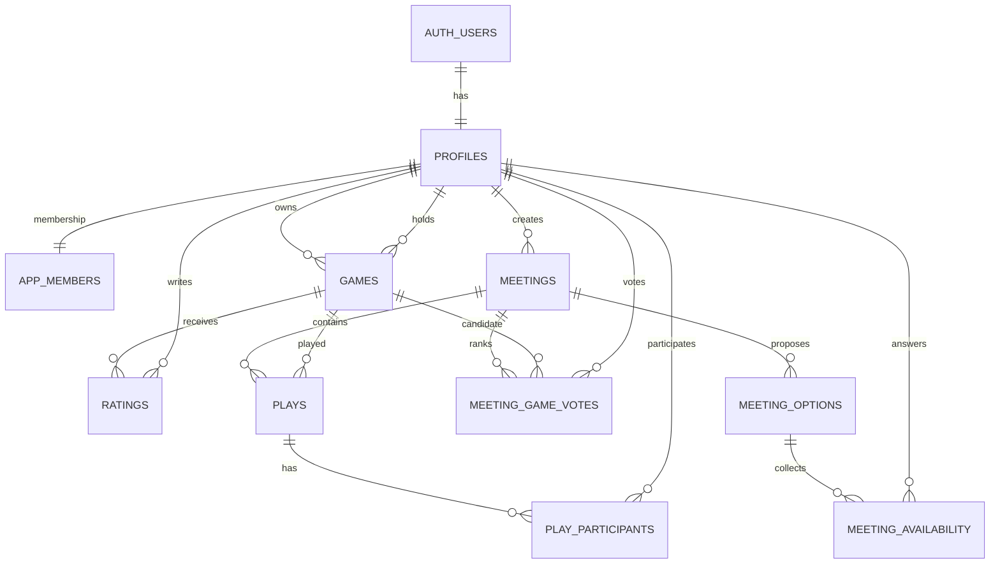

# Projekt MVP 1 — prywatna biblioteka planszówek

Status: analiza i projekt, bez kodu aplikacji.

## 1. Decyzje projektowe

1. Aplikacja obsługuje jedną zamkniętą grupę znajomych. Nie budujemy systemu wielu grup ani publicznych profili.
2. Rekord `game` oznacza fizyczny egzemplarz gry należący do konkretnej osoby. Dwie osoby mogą dodać tę samą grę jako dwa osobne rekordy.
3. Konto można utworzyć wyłącznie przez zaproszenie administratora. W aplikacji nie będzie publicznej rejestracji.
4. Średnia ocena, najlepszy termin i ranking gier na spotkanie są wyliczane z danych źródłowych, a nie zapisywane ręcznie.
5. Mechaniki i kategorie są przechowywane jako listy tagów (`text[]`). Dla małej, prywatnej biblioteki jest to prostsze niż osobne słowniki i tabele pośrednie, a nadal pozwala skutecznie filtrować dane.
6. „Usunięcie” gry z biblioteki ustawia `deleted_at`. Zachowujemy rekord, aby nie zniszczyć ocen i historii partii.
7. Komentarze na karcie gry w MVP 1 pochodzą z ocen użytkowników. Nie powstaje osobny moduł dyskusji.
8. Pierwszy głos na grę podczas spotkania jednocześnie dodaje ją do rankingu propozycji. Osobna tabela propozycji nie jest potrzebna.
9. Daty są przechowywane jako `timestamptz` w UTC i wyświetlane w strefie użytkownika, domyślnie `Europe/Warsaw`.

## 2. Struktura techniczna projektu

### Stack

- Next.js z App Routerem i TypeScript w trybie `strict`.
- React Server Components do odczytu danych i Server Actions do mutacji formularzy.
- Client Components tylko tam, gdzie potrzebna jest bezpośrednia interakcja: filtry, formularze, ankiety i głosowanie.
- Tailwind CSS oraz mały zestaw lokalnych komponentów UI.
- Supabase: Postgres, Auth i opcjonalnie Storage dla avatarów/okładek w dalszej części MVP.
- Walidacja tych samych reguł po stronie formularzy i serwera.
- RLS w bazie jako ostateczna warstwa autoryzacji; ukrycie strony w interfejsie nie jest traktowane jako zabezpieczenie.

### Proponowane katalogi

```text
src/
  app/
    (auth)/
      logowanie/
      ustaw-haslo/
    auth/callback/
    (app)/
      page.tsx                 # dashboard
      moja-polka/
      gry/
      spotkania/
      rozgrywki/
      profil/
      znajomi/[id]/
  components/
    ui/                        # przyciski, pola, dialogi, badge, skeletony
    layout/                    # nawigacja desktop/mobile
  features/
    auth/
    games/
    ratings/
    meetings/
    plays/
    dashboard/
  lib/
    supabase/
      client.ts
      server.ts
    validation/
    dates/
    utils/
  types/
    database.generated.ts
  proxy.ts                     # odświeżanie sesji i wstępna ochrona tras
supabase/
  migrations/
  seed.sql
scripts/
  import-games-csv.ts          # jednorazowy import, bez panelu w UI
tests/
  unit/
  e2e/
```

Kod związany z konkretną funkcją trafia do `features`, a `app` pozostaje cienką warstwą tras i kompozycji ekranów. Zapytania odczytujące dane będą wykonywane na serwerze. Filtry biblioteki będą zapisane w parametrach URL, dzięki czemu widok da się odświeżyć i udostępnić bez utraty stanu.

## 3. Model danych Supabase

### Typy wyliczeniowe

| Typ | Wartości |
|---|---|
| `membership_role` | `member`, `admin` |
| `game_status` | `available`, `unavailable`, `loaned` |
| `meeting_status` | `planned`, `confirmed`, `completed` |

`game_type` pozostaje tekstem. Typy gier mogą się zmieniać i nie warto blokować ich sztywnym enumem.

### Użytkownicy i dostęp

#### `profiles`

| Kolumna | Typ | Uwagi |
|---|---|---|
| `id` | `uuid` PK | FK do `auth.users.id` |
| `display_name` | `text` | wymagane |
| `email` | `text` unique | kopia adresu logowania do wyświetlania, tylko do odczytu w profilu |
| `avatar_url` | `text` nullable | opcjonalny avatar |
| `created_at` | `timestamptz` | automatycznie |
| `updated_at` | `timestamptz` | automatycznie |

#### `app_members`

| Kolumna | Typ | Uwagi |
|---|---|---|
| `user_id` | `uuid` PK | FK do `profiles.id` |
| `role` | `membership_role` | domyślnie `member` |
| `is_active` | `boolean` | warunek wejścia do aplikacji |
| `joined_at` | `timestamptz` | automatycznie |

Oddzielenie członkostwa od profilu zapobiega samodzielnemu nadaniu sobie roli lub ponownemu aktywowaniu konta przez użytkownika.

### Gry

#### `games`

| Kolumna | Typ | Uwagi |
|---|---|---|
| `id` | `uuid` PK | automatycznie |
| `title` | `text` | wymagane |
| `owner_id` | `uuid` | FK do `profiles`; właściciel egzemplarza |
| `current_holder_id` | `uuid` nullable | FK do `profiles`; osoba mająca egzemplarz obecnie |
| `cover_url` | `text` nullable | adres okładki |
| `bgg_url` | `text` nullable | ręcznie wpisywany link |
| `bgg_rank` | `integer` nullable | wartość dodatnia |
| `game_type` | `text` nullable | typ gry |
| `min_players` | `smallint` nullable | minimum graczy |
| `max_players` | `smallint` nullable | maksimum graczy; `min <= max` |
| `play_time_minutes` | `integer` nullable | typowy czas w minutach |
| `release_year` | `smallint` nullable | rok wydania |
| `mechanics` | `text[]` | domyślnie pusta lista |
| `categories` | `text[]` | domyślnie pusta lista |
| `bgg_weight` | `numeric(3,2)` nullable | zakres 1–5 |
| `min_age` | `smallint` nullable | wartość nieujemna |
| `designer` | `text` nullable | autor/projektant |
| `publisher` | `text` nullable | wydawca |
| `expansions` | `text` nullable | zwykły tekst w MVP 1 |
| `description` | `text` nullable | opis |
| `status` | `game_status` | domyślnie `available` |
| `created_at` | `timestamptz` | automatycznie |
| `updated_at` | `timestamptz` | automatycznie |
| `deleted_at` | `timestamptz` nullable | miękkie usunięcie |

Reguły interfejsu:

- przy `available` posiadaczem jest zwykle właściciel;
- przy `loaned` `current_holder_id` powinien wskazywać inną osobę;
- `unavailable` opisuje egzemplarz czasowo niedostępny niezależnie od lokalizacji;
- właściciela nie można przenieść przez zwykłą edycję. Ewentualny transfer własności jest poza MVP 1.

#### `ratings`

| Kolumna | Typ | Uwagi |
|---|---|---|
| `id` | `uuid` PK | automatycznie |
| `game_id` | `uuid` | FK do `games` |
| `user_id` | `uuid` | FK do `profiles` |
| `overall` | `smallint` | 1–10 |
| `replayability` | `smallint` | 1–10 |
| `theme` | `smallint` | 1–10 |
| `wants_to_play_again` | `boolean` | tak/nie |
| `comment` | `text` nullable | komentarz widoczny na karcie gry |
| `created_at` | `timestamptz` | automatycznie |
| `updated_at` | `timestamptz` | automatycznie |

Unikalność: `(game_id, user_id)`. Jedna osoba ma jedną edytowalną ocenę danej gry.

Widok `game_rating_summaries` wylicza co najmniej `average_overall` i `ratings_count`. Można także pokazać średnie składowe, ale głównym rankingiem jest ocena ogólna.

### Spotkania i ankiety

#### `meetings`

| Kolumna | Typ | Uwagi |
|---|---|---|
| `id` | `uuid` PK | automatycznie |
| `created_by` | `uuid` | FK do `profiles` |
| `title` | `text` | wymagane |
| `description` | `text` nullable | opis |
| `location` | `text` nullable | lokalizacja |
| `status` | `meeting_status` | domyślnie `planned` |
| `selected_option_id` | `uuid` nullable | wybrany termin po potwierdzeniu |
| `created_at` | `timestamptz` | automatycznie |
| `updated_at` | `timestamptz` | automatycznie |

#### `meeting_options`

| Kolumna | Typ | Uwagi |
|---|---|---|
| `id` | `uuid` PK | automatycznie |
| `meeting_id` | `uuid` | FK do `meetings`, kasowanie kaskadowe |
| `starts_at` | `timestamptz` | wymagane |
| `ends_at` | `timestamptz` nullable | musi być późniejsze od początku |
| `label` | `text` nullable | np. „sobota wieczorem” |
| `created_at` | `timestamptz` | automatycznie |

Unikalność praktyczna: `(meeting_id, starts_at)`.

#### `meeting_availability`

| Kolumna | Typ | Uwagi |
|---|---|---|
| `meeting_option_id` | `uuid` | FK do `meeting_options` |
| `user_id` | `uuid` | FK do `profiles` |
| `is_available` | `boolean` | jawne tak/nie |
| `updated_at` | `timestamptz` | automatycznie |

Klucz główny: `(meeting_option_id, user_id)`. Formularz zapisuje odpowiedź dla każdego terminu, także `false`. Dzięki temu można odróżnić „nie pasuje mi żaden termin” od „jeszcze nie odpowiedziałem”. Ankieta jest wypełniona, kiedy liczba odpowiedzi użytkownika odpowiada liczbie aktualnych terminów spotkania.

Widok `meeting_option_summaries` wylicza liczbę dostępnych osób dla każdego terminu. Najlepszy termin to najwyższa liczba odpowiedzi `true`; przy remisie jako pierwszy pokazujemy wcześniejszy termin, ale wybór ostatecznie należy do twórcy spotkania.

#### `meeting_game_votes`

| Kolumna | Typ | Uwagi |
|---|---|---|
| `meeting_id` | `uuid` | FK do `meetings` |
| `game_id` | `uuid` | FK do `games` |
| `user_id` | `uuid` | FK do `profiles` |
| `created_at` | `timestamptz` | automatycznie |

Klucz główny: `(meeting_id, game_id, user_id)`. Jeden użytkownik może zagłosować na wiele gier, ale tylko raz na każdą. Widok `meeting_game_rankings` grupuje głosy według spotkania i gry.

### Historia rozgrywek

#### `plays`

| Kolumna | Typ | Uwagi |
|---|---|---|
| `id` | `uuid` PK | automatycznie |
| `game_id` | `uuid` | FK do `games`; usunięcie gry jest blokowane |
| `meeting_id` | `uuid` | FK do `meetings` |
| `created_by` | `uuid` | FK do `profiles` |
| `played_at` | `timestamptz` | faktyczna data partii |
| `duration_minutes` | `integer` nullable | wartość dodatnia |
| `comment` | `text` nullable | komentarz |
| `created_at` | `timestamptz` | automatycznie |
| `updated_at` | `timestamptz` | automatycznie |

#### `play_participants`

| Kolumna | Typ | Uwagi |
|---|---|---|
| `play_id` | `uuid` | FK do `plays`, kasowanie kaskadowe |
| `user_id` | `uuid` | FK do `profiles` |
| `placement` | `smallint` nullable | miejsce dodatnie; remis jest dozwolony |
| `score` | `numeric(12,2)` nullable | opcjonalne punkty |
| `is_winner` | `boolean` | zwycięzca |

Klucz główny: `(play_id, user_id)`. Interfejs MVP 1 wymusza co najmniej jednego gracza i jednego zwycięzcę. Model toleruje współdzielone zwycięstwo lub grę kooperacyjną bez przebudowy bazy.

### Relacje



### Indeksy

- `games(owner_id)`, `games(current_holder_id)`, `games(created_at desc)`.
- indeks po `lower(title)`; dla większej liczby rekordów można dołożyć `pg_trgm`, ale nie jest wymagany na start.
- indeksy GIN na `games(mechanics)` i `games(categories)`.
- `ratings(game_id)`.
- `meetings(status)` i `meeting_options(meeting_id, starts_at)`.
- `meeting_availability(user_id)`.
- `meeting_game_votes(meeting_id, game_id)`.
- `plays(played_at desc)`, `plays(game_id)`, `plays(meeting_id)`.
- `play_participants(user_id)`.

## 4. Ekrany i ścieżki

| Ścieżka | Ekran | Zakres |
|---|---|---|
| `/logowanie` | Logowanie | email + hasło, link odzyskania/ustawienia hasła |
| `/auth/callback` | Obsługa linku z zaproszenia | techniczna trasa bez stałego widoku |
| `/ustaw-haslo` | Ustawienie hasła | używane po zaproszeniu lub odzyskaniu dostępu |
| `/` | Dashboard | najbliższe spotkanie, ankiety, nowe gry, ostatnie partie, top ocen |
| `/moja-polka` | Własna kolekcja | lista/kafelki własnych gier, dodawanie i edycja |
| `/gry` | Biblioteka grupy | wyszukiwanie, wszystkie wymagane filtry, widok mobilny i desktopowy |
| `/gry/nowa` | Dodanie gry | formularz egzemplarza; właścicielem jest zalogowana osoba |
| `/gry/[id]` | Karta gry | szczegóły, oceny i komentarze, średnia, historia partii |
| `/gry/[id]/edytuj` | Edycja gry | tylko właściciel |
| `/spotkania` | Lista spotkań | najbliższe, planowane i zakończone |
| `/spotkania/nowe` | Nowe spotkanie | dane i wiele proponowanych terminów |
| `/spotkania/[id]` | Szczegóły spotkania | terminy, macierz dostępności, najlepszy termin, głosowanie na gry |
| `/spotkania/[id]/edytuj` | Edycja spotkania | tylko twórca |
| `/rozgrywki` | Historia wszystkich partii | filtry po grze, spotkaniu i graczu |
| `/rozgrywki/nowa` | Zapis partii | gra, spotkanie, gracze, wynik, czas, komentarz |
| `/rozgrywki/[id]` | Szczegóły partii | wynik i uczestnicy |
| `/profil` | Mój profil | nazwa, email, avatar, skrót własnej historii |
| `/znajomi/[id]` | Profil znajomego | jego półka i historia rozgrywek |

Ocena jest formularzem na karcie gry, a ankieta i głosowanie są częścią szczegółów spotkania. Nie tworzymy dla nich dodatkowych ekranów.

### Nawigacja i responsywność

- Telefon: dolna nawigacja do Dashboardu, Gier, Spotkań i Rozgrywek; „Moja półka” dostępna z sekcji Gier i profilu.
- Desktop: stały panel boczny lub kompaktowy pasek nawigacji.
- Listy gier: kafelki na telefonie, opcjonalnie gęstszy widok na desktopie.
- Filtry: wysuwany panel na telefonie, panel boczny lub pasek na desktopie.
- Macierz dostępności: na telefonie terminy jako kolumny przewijane poziomo; pierwsza kolumna z osobami pozostaje czytelna.
- Formularze mają duże pola dotykowe, natywne kontrolki daty/czasu i wyraźne stany zapisu/błędu.

## 5. Uprawnienia i RLS

Wszystkie tabele w publicznym schemacie mają włączone RLS. Rola `anon` nie otrzymuje dostępu do danych aplikacji. Każda polityka zaczyna od sprawdzenia, czy `auth.uid()` znajduje się w `app_members` i ma `is_active = true`.

| Zasób | Odczyt | Dodawanie | Edycja/usuwanie |
|---|---|---|---|
| Profile | aktywni członkowie | profil tworzony przy zaproszeniu | użytkownik tylko własną nazwę/avatar; email i członkostwo poza zwykłą edycją |
| Gry | aktywni członkowie | aktywny użytkownik, `owner_id = auth.uid()` | tylko właściciel; `owner_id` pozostaje niezmienny |
| Oceny | aktywni członkowie | tylko jako `user_id = auth.uid()` | tylko autor oceny |
| Spotkania | aktywni członkowie | każdy aktywny członek | tylko twórca spotkania |
| Terminy spotkania | aktywni członkowie | twórca spotkania | twórca spotkania |
| Dostępność | aktywni członkowie | tylko własna odpowiedź | tylko własna odpowiedź |
| Głosy na gry | aktywni członkowie | tylko własny głos | tylko własny głos |
| Rozgrywki | aktywni członkowie | każdy aktywny członek jako `created_by` | tylko autor wpisu |
| Uczestnicy rozgrywki | aktywni członkowie | przez autora wpisu rozgrywki | przez autora wpisu rozgrywki |

Dodatkowe zasady:

- `service_role` jest używany wyłącznie w zaufanym skrypcie importu/seedowania i nigdy nie trafia do przeglądarki.
- Ochrona tras w Next.js poprawia UX, lecz bezpieczeństwo danych zapewnia RLS.
- Widoki agregujące powinny używać `security_invoker = true`, aby respektować polityki tabel źródłowych.
- Funkcja pomocnicza sprawdzająca aktywne członkostwo może znajdować się w niewystawionym schemacie `private` i mieć ustawiony bezpieczny `search_path`.
- Konto usuwamy logicznie przez `app_members.is_active = false`; dane historyczne pozostają spójne.

## 6. Dashboard — reguły danych

- **Najbliższe spotkanie:** potwierdzone spotkanie według wybranego terminu; jeśli brak, najbliższy przyszły termin spotkania planowanego.
- **Ankiety do wypełnienia:** spotkania planowane, dla których użytkownik nie ma odpowiedzi na każdy aktualny termin.
- **Ostatnio dodane gry:** niearchiwalne rekordy po `created_at desc`.
- **Ostatnie rozgrywki:** `plays` po `played_at desc`.
- **Najlepiej oceniane gry:** `average_overall desc`, a przy remisie `ratings_count desc`. W małej grupie nie wymagamy minimalnej liczby ocen, ale pokazujemy ich liczbę.

## 7. Import danych z Google Sheets przez CSV

### Przebieg

1. Eksport arkusza jako UTF-8 CSV.
2. Przygotowanie mapy nazw użytkowników z arkusza do `profiles.id`. Nierozpoznany właściciel lub posiadacz zatrzymuje import danego wiersza i trafia do raportu błędów.
3. Walidacja i normalizacja pól bez zapisu („dry run”).
4. Podgląd raportu: liczba poprawnych rekordów, ostrzeżeń i błędów.
5. Import poprawnych rekordów skryptem uruchamianym lokalnie z kluczem `service_role`.
6. Kontrola duplikatów przede wszystkim po parze `znormalizowana nazwa + właściciel`. Link BGG jest sygnałem pomocniczym, bo wiele osób może posiadać tę samą grę.

### Mapowanie kolumn

| Google Sheets | Pole docelowe | Zasada |
|---|---|---|
| Kto ma aktualnie | `current_holder_id` | mapowanie nazwy na profil |
| Średnia ocena | pomijane | wyliczana z `ratings` |
| Właściciel | `owner_id` | wymagane mapowanie na profil |
| Okładka | `cover_url` | walidacja URL |
| Link BGG | `bgg_url` | walidacja URL, bez pobierania danych |
| Nazwa | `title` | wymagane, trim |
| Typ | `game_type` | trim |
| BGG Rank | `bgg_rank` | liczba dodatnia lub `null` |
| Ilość graczy | `min_players`, `max_players` | `2-5`, `2–5`, `2 do 5`; pojedyncze `4` daje min=max=4 |
| Czas gry | `play_time_minutes` | pojedyncza liczba minut; niejednoznaczne formaty trafiają do raportu |
| Rok wydania | `release_year` | liczba całkowita |
| Mechaniki | `mechanics` | podział po ustalonym separatorze, trim, usunięcie duplikatów |
| Kategorie | `categories` | jak wyżej |
| Trudność BGG | `bgg_weight` | liczba 1–5, przecinek dziesiętny zamieniany na kropkę |
| Minimalny Wiek | `min_age` | liczba nieujemna |
| Autor | `designer` | tekst |
| Wydawca | `publisher` | tekst |
| Dodatki | `expansions` | tekst bez normalizacji relacyjnej |

Status nie istnieje w arkuszu, więc import domyślnie ustawia `available`, chyba że aktualny posiadacz różni się od właściciela — wtedy `loaned`. Opis pozostaje pusty.

Panel importu nie powstaje w MVP 1. Skrypt, przykładowy CSV i krótka instrukcja wystarczą.

## 8. Plan implementacji

### Etap 1 — fundament

- Inicjalizacja Next.js, TypeScript, Tailwind i konfiguracji jakości kodu.
- Zmienne środowiskowe i dwa klienty Supabase: przeglądarkowy oraz serwerowy.
- Podstawowe tokeny wizualne: kolory, typografia, odstępy, komponenty formularzy.
- Weryfikacja: lint, test bazowy i build.

### Etap 2 — baza danych i bezpieczeństwo

- Migracje typów, tabel, ograniczeń, indeksów i `updated_at`.
- RLS oraz testy polityk dla użytkownika aktywnego, nieaktywnego i anonimowego.
- Widoki agregujące dla ocen, ankiet i głosów.
- Generowanie typów TypeScript z bazy.
- Seed małej grupy, kilku gier, spotkania, ocen i partii.
- Weryfikacja: reset lokalnej bazy, seed, testy polityk i build.

### Etap 3 — logowanie i szkielet aplikacji

- Logowanie, obsługa zaproszenia, ustawienie hasła i wylogowanie.
- Weryfikacja sesji oraz aktywnego członkostwa.
- Responsywna nawigacja i pusty dashboard.
- Profil użytkownika.
- Weryfikacja: test logowania i odrzucenia użytkownika spoza grupy, lint/test/build.

### Etap 4 — gry, półka i oceny

- Dodawanie, edycja i archiwizacja własnej gry.
- Moja półka.
- Biblioteka z wyszukiwaniem i wszystkimi filtrami.
- Karta gry.
- Jedna edytowalna ocena użytkownika oraz agregaty ocen.
- Weryfikacja: test uprawnień właściciela, walidacji zakresów, filtrów i oceny; lint/test/build.

### Etap 5 — spotkania, ankiety i propozycje gier

- Lista, tworzenie, edycja i szczegóły spotkania.
- Wiele proponowanych terminów.
- Macierz dostępności, kompletność ankiety i wskazanie najlepszego terminu.
- Potwierdzenie terminu przez twórcę.
- Głosowanie na gry i ranking propozycji.
- Weryfikacja: test remisu terminów, wielokrotnego głosu i uprawnień twórcy; lint/test/build.

### Etap 6 — historia rozgrywek

- Formularz partii i uczestników.
- Zwycięzca, miejsca, punkty, czas i komentarz.
- Historia globalna, na karcie gry oraz na profilu użytkownika.
- Weryfikacja: spójność uczestników/wyników, uprawnienia autora, lint/test/build.

### Etap 7 — dashboard

- Pięć wymaganych sekcji dashboardu.
- Puste stany i linki prowadzące do odpowiednich działań.
- Weryfikacja zapytań dla braku danych, remisów i niepełnych ankiet; lint/test/build.

### Etap 8 — import CSV

- Parser, mapowanie użytkowników, walidacja, dry run i raport.
- Przykładowy CSV oraz instrukcja jednorazowego uruchomienia.
- Weryfikacja na kopii eksportu i sprawdzenie duplikatów.

### Etap 9 — dopracowanie i odbiór

- Test telefonu i desktopu, dostępność klawiatury, kontrast, stany ładowania i błędów.
- Krytyczny test E2E: logowanie → dodanie gry → ocena → spotkanie → ankieta/głos → zapis partii.
- Pełne lint, test i build.
- Instrukcja lokalnego uruchomienia, migracji, seeda i wdrożenia.

Po każdym większym etapie implementacji należy pokazać zwięzłe podsumowanie decyzji, listę zmienionych plików, istotny diff oraz wyniki weryfikacji.

## 9. Granice MVP 1

Poza zakresem pozostają: grywalizacja, punkty i odznaki, rankingi użytkowników, automatyczna integracja z BGG, płatności, publiczny dostęp, panel administracyjny do zaproszeń, rozbudowany panel importu, powiadomienia push/email oraz wielogrupowość. Te elementy można ocenić dopiero po użyciu MVP 1 przez grupę.

## 10. Kryterium gotowości projektu do kodowania

Przed rozpoczęciem implementacji warto zaakceptować trzy decyzje produktowe:

1. konto wyłącznie z zaproszenia, bez rejestracji;
2. gra jako fizyczny egzemplarz należący do jednej osoby;
3. bez osobnych komentarzy poza komentarzem w ocenie.

Pozostałe elementy można wdrażać zgodnie z powyższym planem bez dodatkowego rozszerzania zakresu.
